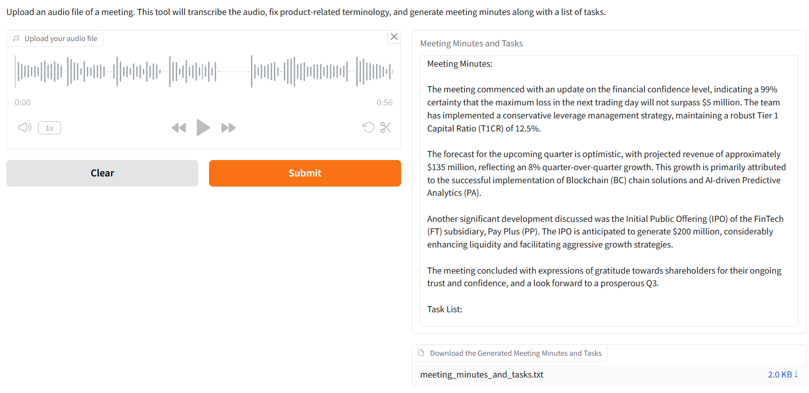

# meetgenie-ai

AI-powered Meeting Assistant that automatically transcribes meetings, adjusts financial product terminology, and generates structured meeting minutes along with actionable task lists.



---

## Features

- **Automatic Speech-to-Text:** Uses Whisper model to transcribe audio meetings.
- **Financial Term Correction:** Adjusts product-related terminology (e.g., "401k" → "401(k) retirement savings plan").
- **Meeting Minutes Generation:** Creates structured summaries of key discussion points and decisions.
- **Task List Extraction:** Identifies actionable items with assignees and deadlines.
- **Web Interface:** Built with Gradio for easy audio upload and output download.
- **LLM Powered:** Leverages IBM Watsonx AI and LangChain for intelligent processing.

---

## Installation

1. **Clone the repository**
```bash
git clone https://github.com/<your-username>/meetgenie-ai.git
cd meetgenie-ai
